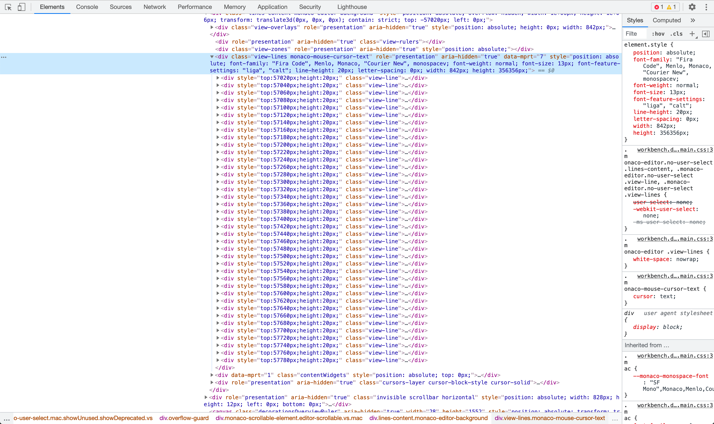

[[toc]]

本文主要探索， VSCode 是如何把 1w+ 行代码呈现出来，且做到滚动不卡顿的。

前不久，一同事与我探讨怎么解决渲染大列表的问题。第一个就想到虚拟列表，但是效果不是特别理想。随后想到 VSCode 在滚动大文件（约 1w 多行代码）的时候，很丝滑。随后便研究了一下。特此记录。

## VSCode 的效果

用 VSCode 随便打开一个 1w+ 的文件，最初加载的时间，会稍微多一点点。但是之后的滚动，却能做到没有丝毫的白屏。无论是滚动还是拖动，效果都非常的丝滑，兼职就像是吃过德芙一样。

## 猜想以及尝试

看到这个效果，的第一想法：VSCode 肯定用了虚拟列表，不然 1w+ 的 dom 节点，仅是渲染，都会让页面卡的不行。

为了验证这个想法，直接找了一个几个 `star` 较高的虚拟列表库，尝试用了用。例如 [react-virtualized][react-virtualized] 、[vue-virtual-scroll-list][vue-virtual-scroll-list]、[ngx-virtual-scroller][ngx-virtual-scroller]。

这三个都很优秀，但是在快速滚动的时候，都还是会出现一点点白屏的间隙。

效果都不是特别理想。看来 VSCode 的做法估计还有点不一样。只有啃啃 VSCode 的源代码才接揭晓答案了。

## 解密 VSCode 的做法

打开 VSCode 的调试工具，看看具体的渲染效果，如下图：



可以看出，的确是利用虚拟列表的技术，仅渲染了可视区域的代码。且是利用 `css` 的 `top` 值来确定每一行代码的相对坐标。

**那么它是怎么做到，快速滚动不白屏的呢？**

带着这个疑问，先试试自己去实现一个虚拟列表，差不多也是依葫芦画瓢，效果不是特别理想。快速滚动的时候也会出现白屏。

粗略分析一下，猜测原因是出在监听 `scroll` 事件上。因为 `scroll` 事件是滚动之后触发的。

> The **scroll** event fires when the document view has been scrolled. --- [MDN](https://developer.mozilla.org/en-US/docs/Web/API/Document/scroll_event)

因此，为了验证这个猜想，把 `scroll` 事件，换成 `wheel` 事件。注：这样的做法并不严谨，但是为了验证猜想足以。

换成 `wheel` 之后，结果稍稍好了一点点，但是快速滚动依旧是有白屏。看来还是不对。

这下就越来越对 VSCode 的做法感兴趣了，那么，是时候展现 VSCode 的技术了。

经过不断的啃代码，总算找到渲染每一行代码的源代码了。
[source: viewLines.ts](https://github.com/microsoft/vscode/blob/aa93eefe550167de3ca29aaa3d06f721a47594a3/src/vs/editor/browser/viewParts/lines/viewLines.ts#L559-L621)

```ts {2,61-62}
	public renderText(viewportData: ViewportData): void {
		// (1) render lines - ensures lines are in the DOM
		this._visibleLines.renderLines(viewportData);
		this._lastRenderedData.setCurrentVisibleRange(viewportData.visibleRange);
		this.domNode.setWidth(this._context.viewLayout.getScrollWidth());
		this.domNode.setHeight(Math.min(this._context.viewLayout.getScrollHeight(), 1000000));

		// (2) compute horizontal scroll position:
		//  - this must happen after the lines are in the DOM since it might need a line that rendered just now
		//  - it might change `scrollWidth` and `scrollLeft`
		if (this._horizontalRevealRequest) {

			const horizontalRevealRequest = this._horizontalRevealRequest;

			// Check that we have the line that contains the horizontal range in the viewport
			if (viewportData.startLineNumber <= horizontalRevealRequest.minLineNumber && horizontalRevealRequest.maxLineNumber <= viewportData.endLineNumber) {

				this._horizontalRevealRequest = null;

				// allow `visibleRangesForRange2` to work
				this.onDidRender();

				// compute new scroll position
				const newScrollLeft = this._computeScrollLeftToReveal(horizontalRevealRequest);

				if (newScrollLeft) {
					if (!this._isViewportWrapping) {
						// ensure `scrollWidth` is large enough
						this._ensureMaxLineWidth(newScrollLeft.maxHorizontalOffset);
					}
					// set `scrollLeft`
					this._context.model.setScrollPosition({
						scrollLeft: newScrollLeft.scrollLeft
					}, horizontalRevealRequest.scrollType);
				}
			}
		}

		// Update max line width (not so important, it is just so the horizontal scrollbar doesn't get too small)
		if (!this._updateLineWidthsFast()) {
			// Computing the width of some lines would be slow => delay it
			this._asyncUpdateLineWidths.schedule();
		}

		if (platform.isLinux && !this._asyncCheckMonospaceFontAssumptions.isScheduled()) {
			const rendStartLineNumber = this._visibleLines.getStartLineNumber();
			const rendEndLineNumber = this._visibleLines.getEndLineNumber();
			for (let lineNumber = rendStartLineNumber; lineNumber <= rendEndLineNumber; lineNumber++) {
				const visibleLine = this._visibleLines.getVisibleLine(lineNumber);
				if (visibleLine.needsMonospaceFontCheck()) {
					this._asyncCheckMonospaceFontAssumptions.schedule();
					break;
				}
			}
		}

		// (3) handle scrolling
		this._linesContent.setLayerHinting(this._canUseLayerHinting);
		this._linesContent.setContain('strict');
		const adjustedScrollTop = this._context.viewLayout.getCurrentScrollTop() - viewportData.bigNumbersDelta;
		this._linesContent.setTop(-adjustedScrollTop);
		this._linesContent.setLeft(-this._context.viewLayout.getCurrentScrollLeft());
	}
```

从源代码可看出，其做法是确保在 `dom` 渲染完成之后，再更新滚动条。那么按照这个想法，就需要捕获所有可能的滚动操作，然后在更新滚动值之前，确保 `dom` 渲染完成。

从理论上来讲，这样的确能有效的防止白屏。

光讲理论怎么行呢，还是要试一下才行。尝试用这个方式，写了一个 [demo: test-vscode-render-lines][vscode-render-lines-demo]，仅实现捕获 `wheel` 事件，效果还不错，无论滚动多快，都没有出现白屏。

## 结语

至此，这次探究告一段论。目前仅尝试在固定每一行高度时，去计算出现在可视区域的 `dom` 元素，这样能在几乎 1 ms
之内完成。那么，问题来了。如果高度不是固定的，是可变的怎么办呢？计算时间会不会增加，如果列表元素太复杂了，渲染时间增加了，会不会出现滚动卡顿的情况？这些都还是需要测试。

目前看来，这种做法，在列表元素较少且高度固定时，表现比普通的虚拟列表好。除此之外的情况，或许还是普通的虚拟列表更优吧，这个就等之后再去探索了。

[react-virtualized]: https://bvaughn.github.io/react-virtualized/#/components/List
[vue-virtual-scroll-list]: https://tangbc.github.io/vue-virtual-scroll-list/#/keep-state
[ngx-virtual-scroller]: https://rintoj.github.io/ngx-virtual-scroller/demo
[vscode-render-lines-demo]: https://0x-jerry.github.io/test-vscode-render-lines/
